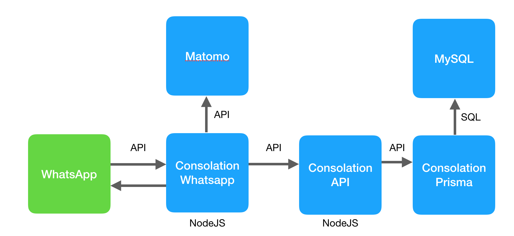

# Consolation
Consolation is an App/WhatsApp Bot that connects a network of volunteers with people that are in need for help

The idea for now:

* Volunteers receive a token so they can enter the platform
* When they are available to help, they indicate to the WhatsApp chatbot indicating that they are online and configure which needs they are prepared to attent
* Someone needing help on the other side choose the type of help they need at that time
* All volunteers that could help that person (depending on its role) receives a message indicating someone is asking for help
* When one of the volunteers attend the "call", a link to a room at http://video.stutz.com.br/room/ABC123 (we will change later) will be sent to both parties so that they can see and see and talk to each other (if the person prefers not to see each other they can "mute" his/her video/audio at any time. The video call is unfurtunatelly done outside WhatsApp to preserv the anonymity of both parties.
* Both identities (from the volunteer and the person asking for help) are anonymous to each other. If they want to exchange contacts, can do during video/audio call in QuickMate.
* At the end, both parties can send an anonymous WhatsApp message to each other through the Bot
* The person that was attended will give a NPS feedback to the volunteer: "Would you recommend this to your friends/family?"

Related repositories:
* http://github.com/ecumeni/consolation-whatsapp
* http://github.com/ecumeni/consolation-api
* http://github.com/ecumeni/consolation-prisma

## Attendance

## Microservices

## Data Model

* Volunteers/People

## Visual Design

Logo ref:
https://thenounproject.com/phantompoints/collection/circle-outline-icons-business-marketing/
